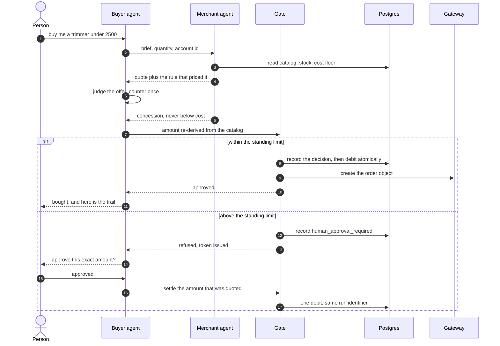
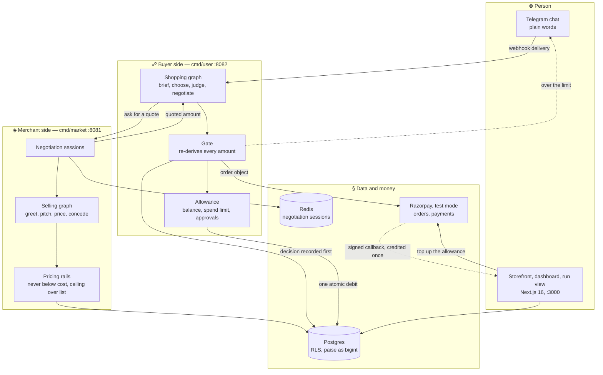
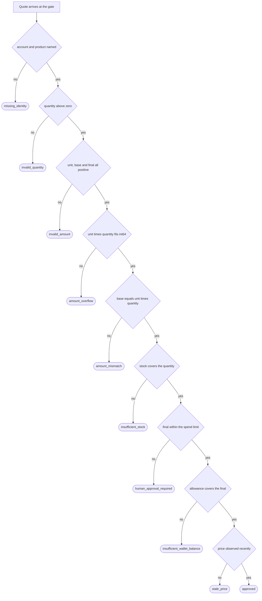

<div align="center">

# ⬢ AgentMart

**A shopping agent that buys from a merchant's own selling agent, over chat, with every rupee bounded by code.**

[](https://github.com/0xarchit/AgentMart/pulse)
[](LICENSE)
[](https://github.com/0xarchit/AgentMart/releases/latest)

[](https://go.dev)
[](https://nextjs.org)
[](https://www.typescriptlang.org)

[](https://supabase.com)
[](https://razorpay.com)
[](https://core.telegram.org/bots/api)
[](https://github.com/0xarchit?tab=packages&repo_name=AgentMart)

</div>

---

## ⬢ Overview

Two agents negotiate. One represents a person and spends from a funded allowance
with a standing limit. The other represents the shop and prices from a real
catalog. **Neither can move money:** charge creation lives in Go, behind a gate
that re-derives every amount from the catalog and refuses in a named way.

A live audit walks eleven shopping situations end to end against the real agents
with no mocks, and not one run in any of them has priced below the merchant's
cost floor.

The whole point is the boundary. A model may propose a product, a quantity, a
counter-offer or a concession. A model may never decide an amount, a basket, an
identity or a gate outcome. Everything a model writes is clamped by
deterministic code before it can touch money, and the fields that must never
reach a model are fenced out of its schema in the type itself.

---

## ✦ Features

| Feature | What it actually means |
| --- | --- |
| **Two live agents** | Both graphs reason against a real provider. There is no scripted decision path in either: when the provider fails, the failure surfaces and names the layer it came from rather than degrading into branches that look like judgement |
| **A gate no model can talk past** | Nine ordered checks re-derive every amount from the catalog before anything is charged, and each returns a named reason. Charge-creating tools are kept out of every tool set, and that exclusion is a test rather than a promise |
| **Negotiation with a floor** | The shop may concede, attach a partner product, or price for cover, handling and scarcity, and never below cost. The buyer counters once and judges what comes back |
| **A funded allowance** | A genuine captured test-mode payment credits the wallet, verified by signature and credited exactly once per payment id |
| **Two ways in** | A public HTTPS url and Telegram posts each update to the buyer, which is what a host that sleeps between requests needs; without one the buyer polls. On the webhook there is one worker per person, so several people are shopped for at once while one person's own messages stay in arrival order |
| **A standing spend limit** | Anything above it is refused with a token and handed to the person. Nothing is spent while that answer is outstanding, and approval settles the exact amount that was quoted |
| **One run identifier** | The conversation on the left, the money it caused on the right, in one view at `/dashboard/runs` |
| **Row level security** | Every table is behind RLS. A buyer reads its own rows and no others |
| **Integers all the way down** | `int64` paise in Go, `bigint` in Postgres, one atomic debit per purchase, one purchase per idempotency key |
| **Tested numbers on screen** | Every displayed figure is produced by a tested function rather than assembled inside a page |
| **One container demo** | `aio_agentmart` runs the merchant, the buyer and the dashboard together, with only the dashboard's port exposed |

---

## ❖ How it works

One purchase, end to end. The gate records its decision **before** it returns
one, and refuses to return at all if it cannot record it.



---

## ◈ Architecture



| Component | Path | Port | Responsibility |
| --- | --- | --- | --- |
| Merchant service | `cmd/market` | `:8081` | catalog, pricing rails, negotiation sessions, agent surface, `/health` |
| Buyer service | `cmd/user` | `:8082` | chat bot, shopping graph, the gate, `/health`, `POST /telegram/webhook` |
| Web | `web/` | `:3000` | storefront, wallet top-up, revenue tiles, run timeline |
| Database | `supabase/migrations/` | — | Postgres with RLS, money as `bigint` paise, atomic fulfilment |
| Session store | Upstash Redis | — | negotiation sessions. The merchant will not start without it |

---

## ⊚ The money rails

The gate is an ordered ladder. The first check that fails names the refusal, and
that name is what the person and the audit row both see. Order matters: a quote
that is both over the limit and unaffordable is reported as the limit problem,
because that is the one a person can answer.



| ⌕ | Reason | What it protects | An approved human decision passes it |
| --- | --- | --- | --- |
| 1 | `missing_identity` | Nothing is charged to an unnamed account or for an unnamed product | no |
| 2 | `invalid_quantity` | No zero or negative basket | no |
| 3 | `invalid_amount` | No zero or negative money | no |
| 4 | `amount_overflow` | The multiplication is checked before it is done, not after | no |
| 5 | `amount_mismatch` | The base has to equal unit price times quantity, re-derived here | no |
| 6 | `insufficient_stock` | Nothing is sold that cannot be allocated | no |
| 7 | `human_approval_required` | The standing limit. Refused with a token, handed to the person | **yes, that is the point** |
| 8 | `insufficient_wallet_balance` | The funded allowance. **No approval overrides this one** | no |
| 9 | `stale_price` | A quote cannot be settled against a price nobody has looked at recently | yes |

Two properties hold across the whole ladder. The decision is written before it is
returned, so an audit failure fails the purchase rather than the record. And a
purchase carries an idempotency key, so a retry settles once.

---

## ☍ The brief, and where each requirement is proven

Track 01 asks for an agent that grows a merchant's revenue or makes a merchant
transactable by an AI buyer, with every money action explainable, bounded and
gated, plus the audit trail and one failure handled gracefully.

| ۞ Requirement | How it is met | Where to look |
| --- | --- | --- |
| Every money action explainable | Every refusal carries an ordered reason, every offer records the rule that priced it, and one run identifier ties the conversation to the money rows it caused | `internal/gate/gate.go`, `internal/marketaudit/`, `supabase/migrations/20260830000100_run_correlation.sql` |
| Bounded | Never below cost, never above the standing ask, never above the balance or the spend limit, one purchase per idempotency key, nothing crosses unrecorded | `internal/gate/gate.go`, `internal/marketgraph/graph.go`, `supabase/migrations/20260825000100_fulfillment_idempotency_lock.sql` |
| Gated | An amount over the limit is refused and handed to the person with a token; the gate fails closed if it cannot record its own decision | `internal/buyer/purchase.go`, `internal/gate/gate.go` |
| No model can spend | Charge creating tools are kept out of every tool set, and that refusal is a test rather than a promise | `TestNoMoneyMovingToolReachesAReasoningLayer` |
| Show the audit trail | One conversation read back as words on the left and money on the right | `/dashboard/runs`, view `run_timeline` |
| One failure handled gracefully | A quote above the limit is refused, nothing is spent while the answer is outstanding, and approval settles the exact amount that was quoted. Pinned as identical on a second run | `internal/buyer/staged_failure_test.go` |
| Payment gateway, test mode | A real order and a real captured payment fund the allowance, verified by signature and credited once per payment id; every agent purchase writes a gateway order object | `web/app/api/razorpay/`, `internal/razorpay/orders.go` |

---

## ∿ Run it

Three ways in, in order of how little you have to install. All three need the
same thing first: a Postgres database with **every migration in
`supabase/migrations/` applied in filename order**, and a filled `.env`.

```bash
cp .env.example .env    # database, gateway test keys, bot token, model access, Redis
```

### ⊚ One container, everything inside

Only the dashboard's port is published. The merchant and the buyer talk to each
other over loopback inside the container, which is what makes this one image
rather than three.

```bash
podman run --rm -p 3000:3000 --env-file .env -v agentmart-data:/data \
  ghcr.io/0xarchit/aio_agentmart:v0.1.0
```

### ❖ Three containers, one per service

```bash
podman run -d --env-file .env -p 8081:8081 ghcr.io/0xarchit/agentmart-market:v0.1.0
podman run -d --env-file .env -p 8082:8082 -v agentmart-data:/data \
  ghcr.io/0xarchit/agentmart-user:v0.1.0
podman run -d --env-file .env -p 3000:3000 ghcr.io/0xarchit/agentmart-web:v0.1.0
```

### ☍ Both agents together, no dashboard

The deployment shape. The merchant sits on loopback, the buyer takes the one
published port so Telegram can reach it, and the dashboard is deployed on its own.

```bash
podman build -f deploy/Containerfile.agents -t agents_agentmart .
podman run -d --env-file .env -p 8082:8082 -v agentmart-data:/data agents_agentmart
```

`ghcr.io/0xarchit/agents_agentmart` carries it from the next version tag onward;
`v0.1.0` predates the image, so build it locally until then.

| Image | What is inside | Published port |
| --- | --- | --- |
| `aio_agentmart` | merchant, buyer, dashboard | dashboard, `3000` |
| `agents_agentmart` | merchant, buyer | buyer, `$PORT` or `8082` |
| `agentmart-market` | merchant | `8081` |
| `agentmart-user` | buyer | `8082` |
| `agentmart-web` | dashboard | `3000` |

Every image is also tagged `latest` and `sha-<commit>`. `docker` works wherever
`podman` appears above.

### ◈ Released binaries

Each release carries raw binaries for both services across Linux, Windows and
macOS on `amd64` and `arm64`, plus `SHA256SUMS`.

```bash
curl -LO https://github.com/0xarchit/AgentMart/releases/download/v0.1.0/market_v0.1.0_linux_amd64
curl -LO https://github.com/0xarchit/AgentMart/releases/download/v0.1.0/user_v0.1.0_linux_amd64
chmod +x market_v0.1.0_linux_amd64 user_v0.1.0_linux_amd64
```

### § From source

Requires Go 1.26 and Node 24.

```bash
go build ./...
go run ./cmd/market               # merchant: catalog, negotiation, agent surface, :8081
go run ./cmd/user                 # buyer: chat bot, shopping graph, the gate, :8082
cd web && npm ci && npm run dev   # storefront, dashboard, run view, :3000
```

Then message the bot in plain words:

```text
buy me a trimmer under 2500
```

> [!IMPORTANT]
> **One buyer process per bot token, whichever way in it uses.** Telegram allows
> one poller per token: a second one gets a 409 and that buyer goes deaf. It also
> refuses `getUpdates` outright while a webhook is registered. A token is
> therefore either polled or posted to, never both, and going back to polling
> means clearing the registration first:
>
> ```bash
> curl "https://api.telegram.org/bot<TOKEN>/deleteWebhook"
> ```
>
> `TELEGRAM_USE_POLLING=true` keeps a local run from registering a URL it could
> never be reached on. If you want a local run and a deployed one at once, a
> second bot token is the cheap answer.

| ✧ What you need | Where it goes | Note |
| --- | --- | --- |
| Postgres URL and keys | `SUPABASE_*` | migrations applied in filename order first |
| Gateway test keys | `RAZORPAY_*` | test mode only, never a live key |
| Bot token | `TELEGRAM_BOT_TOKEN` | one buyer process per token |
| Public URL of the buyer | `TELEGRAM_WEBHOOK_URL` | set it and the buyer takes webhook deliveries; leave it empty and it polls |
| Webhook secret | `TELEGRAM_WEBHOOK_SECRET_TOKEN` | required alongside the URL, checked on every delivery |
| Model access | `OPENAI_API_KEY`, `ADK_MODEL_NAME` | an OpenAI-compatible endpoint |
| Session store | `UPSTASH_REDIS_REST_*` | the merchant will not start without it, and it is where the update offset lives |
| Public base URL of the web app | `NEXT_PUBLIC_APP_URL` | the top-up callback is built from it |

Wallet top-ups credit through the browser callback, which verifies the checkout
signature before crediting, so a local demo needs no gateway webhook and no
tunnel.

---

## ⊛ Deployment

Two pieces, two hosts, and one of them needs a public URL for a reason.

| Piece | Where | Why there |
| --- | --- | --- |
| Storefront and dashboard | Vercel | It is a Next.js app, and it reaches Postgres and the gateway directly. It never calls either agent |
| Both agents | one container on Render | Only the buyer has to be reachable, so Telegram can post to it. The merchant is reached over loopback by the buyer alone |

The buyer is the exposed one because a webhook has to be. That is also what makes
a sleeping host workable: the delivery is the inbound traffic that wakes the
service, where polling would simply stop while it slept.

### ⬢ Both agents on Render

Create a web service from this repo, set the Dockerfile path to
`deploy/Containerfile.agents`, and set the health check path to `/health`. Render
injects `PORT` and the entrypoint binds the buyer to it. An image-backed service
pointed at `ghcr.io/0xarchit/agents_agentmart` works the same way.

Set the environment: `SUPABASE_*`, `RAZORPAY_*`, `TELEGRAM_BOT_TOKEN`,
`OPENAI_API_KEY`, `ADK_MODEL_NAME`, `UPSTASH_REDIS_REST_*`, `MARKET_SHARED_TOKEN`,
`USER_AGENT_TOKEN`, and then the two that turn the webhook on:

```text
TELEGRAM_WEBHOOK_URL=https://<your-service>.onrender.com
TELEGRAM_WEBHOOK_SECRET_TOKEN=<a long random string>
```

The buyer registers that URL with Telegram itself on startup, so there is no
`setWebhook` call to make by hand. A bare host is completed to
`https://<host>/telegram/webhook`, anything that is not HTTPS is refused, and the
process stops rather than starting deaf if the registration fails.

> [!NOTE]
> A free Render service spins down after 15 minutes without inbound traffic. A
> delivery wakes it, but the wake takes long enough that the message which
> triggered it can be lost: send it again and the second one lands. Set
> `UPSTASH_REDIS_REST_*` rather than relying on `/data`, because a free plan has no
> disk, and that is where the update offset and the conversation memory live.

### ❖ The dashboard on Vercel

Import the repo, set the root directory to `web`, and set `SUPABASE_*`,
`RAZORPAY_KEY_ID`, `RAZORPAY_KEY_SECRET`, `RAZORPAY_WEBHOOK_SECRET` and
`NEXT_PUBLIC_APP_URL` to the Vercel URL. The top-up callback is built from that
last one, so a wrong value breaks funding rather than the build. The browser is
handed the gateway key id by `/api/topups/orders`, so there is no public key
variable to set. `output: "standalone"` in `web/next.config.ts` is there for the
container images; Vercel builds the app its own way.

Both hosts point at the same database, which is what ties the two halves together:
the dashboard reads the rows the agents write, and no request crosses between them.

---

## ⌕ What is real, and what is not

Worth stating plainly, because the difference is the whole credibility of the
rest.

**Real.** The allowance is funded by a genuine captured test-mode payment,
verified by signature and credited exactly once per payment id. Every agent
purchase creates a gateway order object. Every bound in the gate is enforced in
code and covered by a test per reason. The situation audit and the paired
benchmark run the real agents against a real provider, with nothing replayed or
mocked, and both have caught real defects in our own agents that reading the code
had not. Twenty five situations are catalogued and eleven of them run end to end
today; the rest need capabilities this system does not have yet, which is
recorded rather than hidden.

**Not real yet.** The settling step itself moves money inside our own ledger
rather than drawing on the gateway. The design for that is a mandate authorised
once and drawn per purchase with no person in the loop, and that draw is not
available to this account. We probed it rather than assuming: the one route that
charges a mandate with nobody present refuses every request shape, including an
empty body, before it reads a payload, while ten other endpoints answer normally
on the same credential in the same session, and the scheduled charging APIs
refuse a good secret differently from a wrong one. It is a capability granted per
account on request, not a test mode restriction, and registering a mandate
succeeds convincingly right up to the point of charging it.
[`docs/architecture.md`](docs/architecture.md) section 5 carries the evidence.
Settlement is therefore one interface behind the gate, so enabling it is a one
file change and not one bound moves.

**What we turned down.** A payment link per purchase would have produced a real
captured payment for every sale, and it puts a person in every transaction, which
contradicts the one thing this system is for. Authorising a payment and capturing
it later needs no person either, and we turned that down too: the amount is fixed
at authorisation, and an agent that settles on a price by negotiating it cannot
supply that number in advance.

---

## ۞ Verification

This is the gate every change passes before it lands. `-short` is not optional:
the long tests spend live paid provider quota.

```bash
gofmt -l .
go build ./...
go vet ./internal/... ./cmd/...
go test -short -count=1 ./internal/... ./cmd/...
cd web && npm run build && npx tsc --noEmit && npx vitest run
```

| ✦ Check | What it covers |
| --- | --- |
| `go test -short` | 28 packages: the money paths, the gate ladder reason by reason, the graphs |
| `npx vitest run` | the figures on the dashboard, so no number is assembled inside a page |
| `npx tsc --noEmit` | run after `npm run build`, because route types are generated |
| Situation audit | eleven shopping situations end to end against the real agents |
| Benchmark | the measured comparison against a fixed price list |

Every new test is mutation verified: break the code it covers, watch it fail with
a message that names the real problem, restore it, watch it pass. A test that
passes both ways proves nothing. The same gate runs on every push and pull
request in [`.github/workflows/gate.yml`](.github/workflows/gate.yml), and a
version tag additionally builds the binaries and the four images.

---

## § Known limitations

Stated because they are decisions, not because they were discovered late.

- **A price may settle below list** only as far as the buyer's funded loyalty
  entitlement, and never below cost. With no campaign the floor is the list
  total, which is what every anonymous caller gets.
- **An attached partner product is charged for but not reserved.** The bundle is
  only offered when the partner has stock at quote time, and its amount is kept
  out of the merchant's uplift figure, but no row is held against it between the
  quote and the debit.
- **A run is one shot for pricing, but no longer for conversation.** A follow-up
  such as "the second one" or "cheaper" continues against the shortlist the shop
  last showed, and a message sent while a decision is outstanding answers that
  decision instead of starting again. What is carried forward is the conversation
  only: every amount is re-derived and every bound re-read on each run.
- **The opening quote's bounds are chosen, even though the amounts inside them
  are not.** What the shop may add for cover, handling and scarcity is argued
  from the selling rate, stock cover and the gateway's refund rate, and nothing
  is charged for unless the fact behind it was read. The ceilings on each of
  those, and the twelve percent ceiling over list, are still a judgement call
  rather than a measurement.
- **The buyer's account identifier on the negotiation call is self asserted.** It
  cannot move money past the gate, which re-derives every amount, but it can
  claim another account's loyalty tier.
- **The gateway sales view is one page deep.** Enough for a demo account, not for
  a merchant with a long history.
- **Reasoning runs against a free model pool that is often rate limited.**
  Latency is traded for reliability on purpose: each model is retried before the
  next is tried.

---

## ℡ Docs and links

| ⌕ | Document | What it is for |
| --- | --- | --- |
| ◈ | [`docs/architecture.md`](docs/architecture.md) | the design contract behind every choice above, including the closed and open findings |
| ❖ | [`docs/docs.md`](docs/docs.md) | the implementation map: routes, data model, verification steps |
| ∿ | [`docs/benchmark.md`](docs/benchmark.md) | the measured comparison against a fixed price list, methodology above its own numbers |
| ☍ | [`.github/CONTRIBUTING.md`](.github/CONTRIBUTING.md) | the one rule that matters, the gate, commit conventions, migrations |
| ۞ | [`.github/SECURITY.md`](.github/SECURITY.md) | what is in scope, and how to report privately |
| § | [`.github/CODE_OF_CONDUCT.md`](.github/CODE_OF_CONDUCT.md) | Contributor Covenant 2.1 |

Packages are published to
[GHCR](https://github.com/0xarchit?tab=packages&repo_name=AgentMart) and binaries
to [Releases](https://github.com/0xarchit/AgentMart/releases).

---

## ✧ License

[MIT](LICENSE) © 2026 [0xarchit](https://github.com/0xarchit)

<div align="center">

**⬢ Every money action explainable, bounded and gated. ⬢**

</div>
